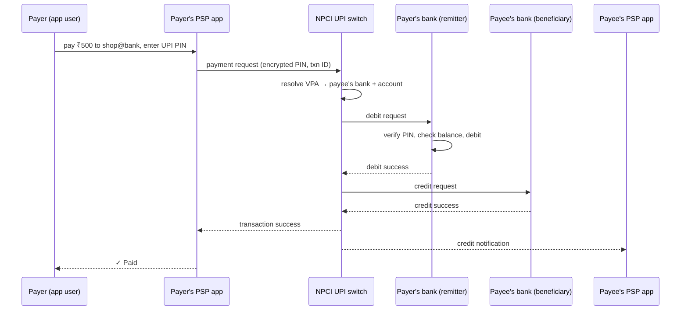

# How UPI (Unified Payments Interface) Works

*Instant bank-to-bank payments across hundreds of banks and apps — billions of transactions a month — by putting a shared switch and shared rules at the center of the ecosystem.*

---

> *“The Transaction Concept: Virtues and Limitations.”*
>
> — **Jim Gray**, paper title, VLDB 1981

## At a Glance

> **In one sentence:** UPI lets anyone send money instantly using a simple address like `name@bank`: a payment app (the PSP) sends the request through NPCI's central UPI switch, the payer's bank verifies the UPI PIN and debits the account, the payee's bank credits it, and confirmations flow back in seconds — with strict timeouts, status checks, and automatic reversals handling the cases where something fails midway.

**You'll learn**

- The participants: payer and payee, PSP apps, banks, and NPCI's switch
- Virtual payment addresses (VPAs) and why they matter
- The pay flow step by step, including PIN verification
- Push (pay) vs. pull (collect) requests
- Handling timeouts, pending states, and reversals across many independent banks
- Why an interoperable public infrastructure scaled so fast

**Before you start:** [Designing A Payment System](../06-System-Design/Designing-A-Payment-System.md) · [Why Distributed Systems Are Hard](../05-Distributed-Systems/Why-Distributed-Systems-Are-Hard.md)

**Reading time:** about 10 minutes

---

## The Big Picture



*One transaction touches at least four independent organizations — and must end up consistent even when any of them is slow or fails.*

---

## Introduction

In a small shop in India, a customer scans a QR code, types an amount, enters a four- or six-digit PIN, and the shopkeeper's phone announces the payment a couple of seconds later. No card, no card machine, no fee for the customer, and it works between any bank and any app.

That experience runs on the **Unified Payments Interface (UPI)**, launched in 2016 by the National Payments Corporation of India (NPCI). By 2023, UPI was processing more than 10 billion transactions a month, and volumes have kept growing — making it one of the largest real-time payment systems in the world.

UPI is a fascinating case study because it's not one company's system. It's **shared infrastructure**: a central switch plus common rules that hundreds of banks and payment apps plug into. The engineering challenges are those of any distributed transaction — timeouts, partial failures, reconciliation — multiplied across many independently run organizations.

### Why Study It?

- It shows how interoperability and shared standards can scale an ecosystem.
- It's a real-world example of distributed transactions without a single database.
- Its handling of timeouts and reversals illustrates payment-system principles at massive scale.

---

## Scale and Constraints

| Dimension | Public information / consideration |
|----------|-----------------------------------|
| Volume | Over 10 billion transactions per month since 2023, growing further |
| Participants | Hundreds of banks and many third-party apps |
| Latency | Seconds, end to end |
| Availability | Expected around the clock, every day |
| Security | Two-factor: bound device + UPI PIN; regulated by the Reserve Bank of India |
| Cost | Free for most person-to-person and person-to-merchant payments for users |

---

## Historical Background

- **2008 — NPCI established** as an umbrella organization for retail payments in India, promoted by the Reserve Bank of India and the Indian Banks' Association.
- **2010 — IMPS** (Immediate Payment Service) enabled instant interbank transfers — the real-time rails UPI builds on.
- **2016 — UPI launched** (April 2016), adding virtual payment addresses, a common app interface, and both push and pull payments.
- **2016 onward — Rapid adoption,** accelerated by smartphone and cheap mobile data growth and QR-code payments at merchants.
- **2019 — RBI turnaround-time rules** standardized timelines for resolving failed transactions and auto-reversals.
- **2022 — New capabilities:** UPI Lite for small payments, UPI 123PAY for feature phones, and credit cards (RuPay) on UPI.
- **2023 onward — International links** began connecting UPI with other countries' fast-payment systems (for example, Singapore's PayNow).

---

## Architecture Overview

### Participants

| Participant | Role |
|------------|-----|
| Payer / payee | People or merchants sending and receiving money |
| PSP (payment service provider) app | The app users interact with (bank apps or third-party apps with a sponsor bank) |
| Remitter bank | The payer's bank: verifies the PIN and debits the account |
| Beneficiary bank | The payee's bank: credits the account |
| NPCI UPI switch | Central router: resolves addresses, routes requests, enforces rules, tracks status |

### Virtual Payment Addresses (VPAs)

A VPA like `priya@okbank` hides account numbers. The payee's PSP maps it to the real bank account. Users can have several VPAs and change banks without telling everyone new account details.

### Security: Two Factors

1. **Device binding:** the app verifies the user's registered mobile number, typically by sending an SMS from the device, binding the app to that phone and SIM.
2. **UPI PIN:** entered in a secure interface, encrypted on the device, and verified by the **remitter bank** — PSP apps never see it in plain form.

### Push and Pull

- **Pay (push):** the payer initiates and authorizes with their PIN.
- **Collect (pull):** a payee requests money; the payer approves in their app with their PIN. (Collect requests are also a common vector for scams, so apps warn users and limits apply.)

---

## Deep Dives

### Deep Dive 1: One Transaction, Many Organizations

There's no single database spanning the remitter bank, NPCI, and the beneficiary bank. Each keeps its own records. The switch coordinates a sequence — debit, then credit — and every participant records the unique transaction ID. This is a distributed transaction handled through **messages, states, timeouts, and reconciliation** rather than a global lock.

### Deep Dive 2: Timeouts, Pending States, and Reversals

The hardest cases are partial failures:

| Situation | What happens |
|----------|-------------|
| Debit fails | Transaction fails; nothing to undo |
| Debit succeeds, credit succeeds | Success |
| Debit succeeds, credit fails | Payer's bank must reverse the debit |
| Debit succeeds, credit status unknown (timeout) | Transaction is **pending**; status is checked and resolved; if credit didn't happen, the debit is reversed |

Apps show "pending" rather than guessing, provide status checks, and RBI rules set turnaround times for automatic reversal of failed transactions (for UPI, typically by the next business day). Every participant reconciles against the switch's records.

### Deep Dive 3: Idempotency and Unique IDs

Each transaction has a unique ID generated at initiation. Retries and status queries use the same ID, so a network retry can't debit twice — the same principle as idempotency keys in [Designing A Payment System](../06-System-Design/Designing-A-Payment-System.md).

### Deep Dive 4: Scaling Shared Infrastructure

Growth in volume puts pressure on every participant, not just NPCI: a slow or overloaded bank causes failures for its customers across all apps. NPCI publishes performance data per bank (such as technical decline rates), creating incentives for banks to improve reliability. Features like **UPI Lite** move very small payments to an on-device wallet balance, reducing load on bank core systems for tiny transactions.

---

## What Can Go Wrong

- **Bank downtime or slowness** → technical declines; users retry with another account; per-bank reliability metrics push improvement.
- **Timeouts with unknown outcomes** → pending state, status checks, automatic reversals.
- **Fraud and social engineering** (fake collect requests, screen-sharing scams) → warnings, limits, cooling periods, and user education.
- **Peak events** (festivals, month-start salary days) → capacity planning across the ecosystem.

---

## Lessons for Engineers

1. **Shared standards create network effects** — any app, any bank, one address format.
2. **Distributed transactions need explicit states:** success, failure, and *pending*, with resolution processes.
3. **Unique transaction IDs and idempotency** make retries safe across organizations.
4. **Reconciliation is the backbone** of correctness when many parties keep their own books.
5. **Publish reliability metrics** to create accountability in an ecosystem.

---

## Tradeoffs

| Choice | Benefit | Cost |
|-------|--------|-----|
| Central switch | Interoperability, common rules, visibility | Critical central dependency; must be extremely reliable |
| Real-time settlement experience | Instant confirmation for users | Complex failure handling across banks |
| VPAs | Privacy and convenience | Address management and spoofing risks |
| Free for users | Massive adoption | Funding the infrastructure is a policy question |
| Collect requests | Convenient merchant flows | Scam vector requiring safeguards |

---

## Interview Questions

### Beginner

**Q1: What is a VPA, and why is it useful?**

*Model answer:* A virtual payment address (like `name@bank`) that maps to a bank account. It lets people pay and receive money without sharing account numbers, and users can switch underlying accounts without changing their address.

### Intermediate

**Q2: What happens if the payer is debited but the payee's credit times out?**

*Model answer:* The transaction goes into a pending state. Participants check status using the unique transaction ID; if the credit didn't complete, the payer's bank reverses the debit within the regulated turnaround time. Reconciliation across participants ensures the final state is consistent.

### Senior

**Q3: How does UPI avoid double debits when requests are retried?**

*Model answer:* Every transaction carries a unique ID from initiation; retries and status queries reuse it, and participants treat repeated requests for the same ID idempotently, returning the existing result instead of processing again.

### Architecture

**Q4: Design a real-time payment network connecting many banks. What are the key components?**

*Model answer:* A central switch for routing, address resolution, and rule enforcement; standardized APIs and message formats; strong participant authentication; unique transaction IDs; defined states including pending; timeouts and status-check APIs; automatic reversal rules; daily settlement and reconciliation between banks; per-participant monitoring and published reliability metrics; fraud controls and limits; and regulatory oversight.

---

## Hands-On Lab

Simulate UPI-style transactions where the credit leg can fail or time out, and resolve them with status checks and reversals. Pure Python; save as `upi_lab.py` and run it.

```python
import random, uuid
random.seed(12)

class Bank:
    def __init__(self, name, balance): self.name, self.balance, self.txns = name, balance, {}
    def debit(self, txn, amount):
        if txn in self.txns: return self.txns[txn]              # idempotent
        if self.balance < amount: return "insufficient"
        self.balance -= amount; self.txns[txn] = "debited"; return "debited"
    def reverse(self, txn, amount):
        if self.txns.get(txn) == "debited":
            self.balance += amount; self.txns[txn] = "reversed"
    def credit(self, txn, amount, failure_rate, timeout_rate):
        r = random.random()
        if r < failure_rate: return "failed"
        self.balance += amount; self.txns[txn] = "credited"      # money arrives...
        return "timeout" if r < failure_rate + timeout_rate else "credited"   # ...but the reply may be lost

def pay(payer, payee, amount, failure_rate=0.03, timeout_rate=0.05):
    txn = uuid.uuid4().hex[:10]
    if payer.debit(txn, amount) != "debited":
        return "FAILED (debit)"
    result = payee.credit(txn, amount, failure_rate, timeout_rate)
    if result == "credited":
        return "SUCCESS"
    if result == "failed":
        payer.reverse(txn, amount)
        return "FAILED -> reversed"
    # timeout: never guess - check the beneficiary bank's status with the same txn ID
    status = payee.txns.get(txn)
    if status == "credited":
        return "PENDING -> SUCCESS after status check"
    payer.reverse(txn, amount)
    return "PENDING -> reversed after status check"

alice, shop = Bank("alice-bank", 100_000), Bank("shop-bank", 0)
outcomes = {}
for _ in range(1_000):
    r = pay(alice, shop, 50)
    outcomes[r] = outcomes.get(r, 0) + 1
for k, v in sorted(outcomes.items(), key=lambda x: -x[1]):
    print(f"{k:40} {v}")
print(f"\nmoney conserved: {alice.balance + shop.balance == 100_000}  "
      f"(alice {alice.balance}, shop {shop.balance})")
```

**What to notice**
- Most payments succeed immediately; some fail and are reversed; some time out even though the money actually arrived.
- The timeouts are resolved by checking status with the same transaction ID — never by guessing "failed" (which would reverse money the payee already received) or "success" (which could lose the payer's money).
- Money is conserved across both banks in every case — the whole point of careful state handling and reconciliation.

---

## Test Yourself

*Answer each question in your head or on paper first, then open the answer to check.*

<details markdown="1">
<summary><strong>1. Which organization runs UPI's central switch?</strong></summary>

The National Payments Corporation of India (NPCI).

</details>

<details markdown="1">
<summary><strong>2. What are UPI's two authentication factors?</strong></summary>

A bound device (verified mobile number/SIM on the phone) and the UPI PIN, which is verified by the payer's bank.

</details>

<details markdown="1">
<summary><strong>3. What's the difference between a pay request and a collect request?</strong></summary>

Pay is initiated by the payer (push); collect is initiated by the payee and must be approved by the payer with their PIN (pull).

</details>

<details markdown="1">
<summary><strong>4. Why is "pending" a necessary state?</strong></summary>

When a step times out, the outcome is unknown; marking it pending and resolving it via status checks avoids wrongly failing or succeeding a transaction.

</details>

<details markdown="1">
<summary><strong>5. What existing rails does UPI build on?</strong></summary>

IMPS (Immediate Payment Service), India's real-time interbank transfer system.

</details>

<details markdown="1">
<summary><strong>6. What does UPI Lite do?</strong></summary>

It handles small payments from an on-device balance, reducing load on bank core systems and speeding up tiny transactions.

</details>

---

## Cheat Sheet

**Flow:** app (PSP) → NPCI switch (resolve VPA) → remitter bank (verify PIN, debit) → beneficiary bank (credit) → confirmations.

| Concept | Why |
|--------|----|
| VPA (`name@bank`) | Pay without sharing account numbers |
| Device binding + UPI PIN | Two-factor authentication |
| Unique transaction ID | Idempotent retries and status checks |
| Pending state | Unknown outcomes resolved, not guessed |
| Auto-reversal rules | Failed transactions returned within set timelines |
| Reconciliation | Every participant's books agree |
| Per-bank reliability metrics | Ecosystem accountability |

**Timeline:** 2008 NPCI · 2010 IMPS · 2016 UPI launch · 2019 RBI turnaround rules · 2022 UPI Lite, 123PAY, credit on UPI · 2023 10B+ transactions/month.

---

## In the AI Era

- **Fraud detection at UPI scale** relies heavily on machine learning over transaction patterns, device signals, and behavior — running in real time within strict latency budgets, with safe defaults if models are slow.
- **AI-powered scams** (convincing voice calls, fake messages) increase social-engineering risk; product safeguards like warnings, cooling periods, and limits matter more.
- **Conversational payments** — paying through voice or chat assistants — are being explored in UPI's ecosystem; they must keep the same authentication and confirmation guarantees.

**Try it:** Add a fraud-check step to the lab that sometimes takes too long. Decide a policy (allow small amounts, hold large ones) and implement it with a deadline.

---

## Key Takeaways

1. UPI is shared infrastructure: a central switch plus common standards connecting many banks and apps.
2. VPAs, device binding, and bank-verified PINs make payments simple and secure.
3. Each payment is a distributed transaction across independent organizations.
4. Timeouts create unknown outcomes; pending states, status checks, and reversals resolve them.
5. Unique transaction IDs, idempotency, and reconciliation keep money correct at huge scale.

---

## What to Read Next

- **[How Netflix Streams Video](How-Netflix-Streams-Video.md)** — global delivery infrastructure
- **[Designing A Payment System](../06-System-Design/Designing-A-Payment-System.md)** — the general principles behind payment correctness
- **[Why Distributed Systems Are Hard](../05-Distributed-Systems/Why-Distributed-Systems-Are-Hard.md)** — why timeouts create uncertainty

---

## Further Reading

- **NPCI — UPI product overview and statistics:** [https://www.npci.org.in/what-we-do/upi/product-overview](https://www.npci.org.in/what-we-do/upi/product-overview)
- **Reserve Bank of India — Harmonisation of Turn Around Time and customer compensation for failed transactions (2019)**
- **Jim Gray — "The Transaction Concept: Virtues and Limitations" (VLDB 1981)**
- **Jim Gray & Andreas Reuter — "Transaction Processing: Concepts and Techniques" (1992)**
- **BIS — reports on fast payment systems** (including UPI) from the Bank for International Settlements: [https://www.bis.org](https://www.bis.org)

---

*This chapter is part of the Modern Software Engineering Handbook — a comprehensive guide to the concepts, principles, and practices that every professional software engineer should know.*
