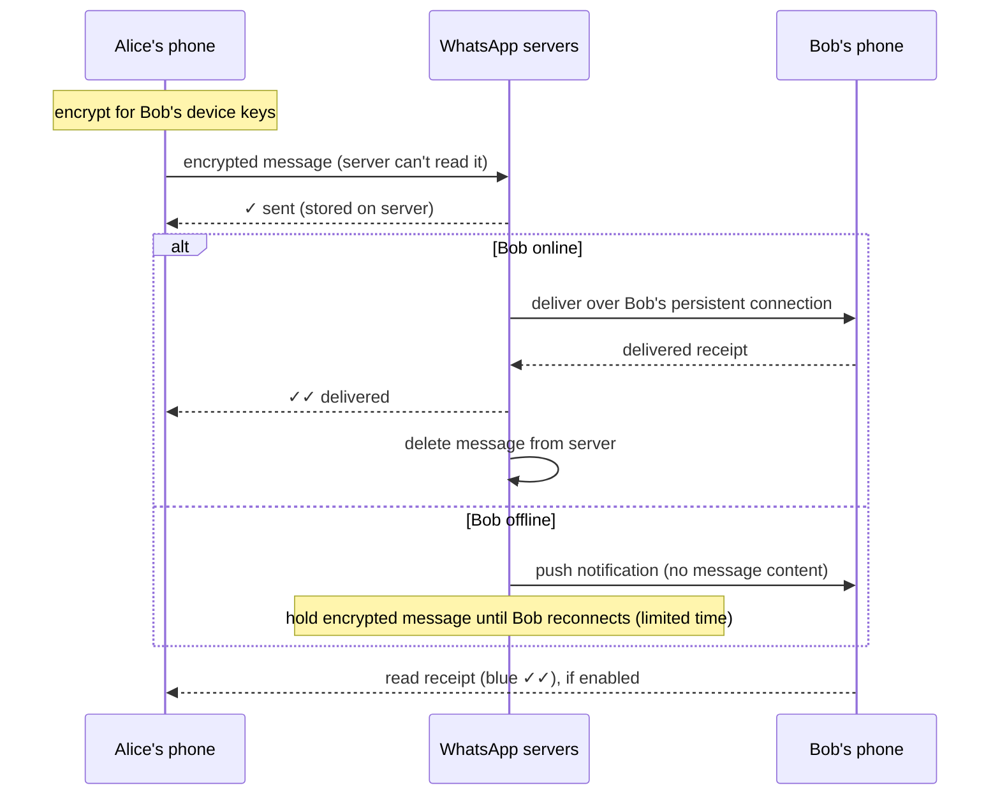

# How WhatsApp Works

*Billions of users, end-to-end encryption, and famously small engineering teams — built on persistent connections, store-and-forward delivery, and ruthless simplicity.*

---

> *“No Ads! No Games! No Gimmicks!”*
>
> — **Brian Acton's note on Jan Koum's desk**, described in WhatsApp's 2012 blog post "Why we don't sell ads"

## At a Glance

> **In one sentence:** WhatsApp keeps a persistent connection from each phone to chat servers, relays end-to-end encrypted messages it cannot read, stores them only until they are delivered (store-and-forward), confirms delivery with receipts, and achieves enormous scale per server through Erlang's lightweight processes, careful tuning, and a deliberately focused product.

**You'll learn**

- Persistent connections and why WhatsApp needed millions per server
- Store-and-forward delivery and message receipts (the ticks)
- Why Erlang fit the problem
- End-to-end encryption with the Signal Protocol, including groups and multiple devices
- Media handling and push notifications
- Lessons from running a huge service with a small team

**Before you start:** [Designing A Chat System](../06-System-Design/Designing-A-Chat-System.md) · [Cryptography for Engineers](../09-Security/Cryptography-For-Engineers.md)

**Reading time:** about 10 minutes

---

## The Big Picture



*The server is a relay and a temporary mailbox — not an archive. Encrypted messages are removed once delivered.*

---

## Introduction

In February 2014, Facebook agreed to acquire WhatsApp for about $19 billion. At the time, WhatsApp served hundreds of millions of monthly users with an engineering team that was famously small — the company had around 55 employees. Two years earlier, a WhatsApp engineering blog post reported more than 2 million concurrent connections on a single server.

How can so few people run something so large? Part of the answer is technology — Erlang, FreeBSD, and careful tuning. But much of it is **focus**: a product that does one thing (messaging), with few features, no ads, and an architecture that avoids storing messages long-term. Fewer features mean fewer systems to build and operate.

### Why Study It?

- It's a real-world model of the chat system design in [Designing A Chat System](../06-System-Design/Designing-A-Chat-System.md).
- It shows how the right runtime (Erlang) matches a problem with millions of concurrent, mostly idle connections.
- It demonstrates end-to-end encryption deployed to billions of people.

---

## Scale and Constraints

| Dimension | Public information |
|----------|-------------------|
| Users | More than 2 billion (announced 2020) |
| Connections | Millions of concurrent connections per server (2 million+ reported in 2012) |
| Networks | Slow, unreliable mobile networks worldwide |
| Devices | Low-end phones with limited battery and data |
| Privacy | End-to-end encryption for all users since 2016 |

Mobile constraints mattered from day one: small payloads, efficient reconnects, and battery-friendly behavior.

---

## Historical Background

- **2009 — WhatsApp founded** by Jan Koum and Brian Acton, first as a status app, then as messaging.
- **Early 2010s — Built on Erlang,** using a heavily modified version of the open-source ejabberd (XMPP) server and running on FreeBSD.
- **2012 — "1 million is so 2011":** the engineering blog reported over 2 million concurrent TCP connections on one server.
- **2014 — Facebook acquisition** (announced in February, about $19 billion).
- **2016 — End-to-end encryption** using the Signal Protocol completed for all users.
- **2020 — 2 billion users** announced.
- **2021 — Multi-device support** launched, letting companion devices work without the phone online while keeping end-to-end encryption.

---

## Architecture Overview

### Persistent Connections

Each phone keeps a long-lived connection to a chat server while the app is active. The server knows which users are connected where, so it can deliver messages immediately. Most connections are idle most of the time — exactly the situation Erlang handles well.

### Why Erlang?

Erlang was designed at Ericsson in the 1980s for telephone switches: huge numbers of concurrent, lightweight processes; message passing between them; isolation so one crash doesn't take down others; supervisors that restart failed processes; and hot code upgrades. A chat server with millions of connections maps naturally to millions of Erlang processes.

### Store-and-Forward

- The server stores an encrypted message **only until it is delivered**.
- Once delivered, it's deleted from the server.
- If the recipient doesn't come online, undelivered messages are deleted after a limited period (WhatsApp describes 30 days).

This keeps storage small and supports privacy — the server isn't a long-term archive of conversations.

### Receipts

- **One tick:** the server received the message.
- **Two ticks:** delivered to the recipient's device.
- **Two blue ticks:** read (if read receipts are enabled).

Each tick is itself a small message flowing back to the sender.

### Media

Photos, videos, and documents are encrypted on the sender's device and uploaded to storage; the message carries a pointer and the decryption key (inside the end-to-end encrypted message). The recipient downloads and decrypts the media.

### Push Notifications

When the recipient's app isn't connected, the server sends a push notification through Apple's or Google's services to wake the app, which then connects and fetches messages. The notification doesn't need to contain the message content.

---

## Deep Dives

### Deep Dive 1: End-to-End Encryption

WhatsApp uses the **Signal Protocol**:

- Each device has identity keys and prekeys; public keys are published to the server.
- Senders establish a session with the recipient's device using those keys, then use a **double ratchet** that changes keys with every message, providing forward secrecy.
- The server relays ciphertext it cannot decrypt.
- Users can verify each other's keys with security codes.

**Groups** use sender keys distributed to members, so a sender encrypts a message once for the group rather than separately for every member. **Multiple devices** each have their own keys, and messages are encrypted for each of a user's devices.

### Deep Dive 2: Scaling Per Server

Handling millions of connections per machine required tuning the operating system (file descriptors, TCP buffers, kernel settings), the Erlang VM, and the application — WhatsApp's engineers publicly described extensive profiling and tuning work. High per-server capacity means fewer servers, less coordination, and a smaller operations burden.

### Deep Dive 3: Simplicity as a Strategy

No ads means no ad-targeting systems. No long-term message storage means no massive archive to scale, back up, and protect. A focused feature set means fewer services. Architectural simplicity is a direct result of product decisions.

---

## What Can Go Wrong

- **Reconnect storms** after outages — clients back off and reconnect gradually.
- **Offline users and lost phones** — undelivered messages expire; backups (optionally end-to-end encrypted) are the user's responsibility.
- **Spam and abuse** — harder with end-to-end encryption, so detection relies on metadata, user reports, and rate limits.
- **Large outages** — WhatsApp was affected by the October 2021 outage of Facebook's (now Meta's) infrastructure, showing that even a simple product depends on shared platform layers.

---

## Lessons for Engineers

1. **Match the runtime to the workload** — millions of mostly idle connections suit lightweight processes.
2. **Don't store what you don't need** — store-and-forward keeps systems small and private.
3. **Product focus reduces architecture** — every feature adds systems to build and run.
4. **Tune deeply before scaling wide** — high per-server efficiency reduces operational complexity.
5. **Privacy can be an architectural property**, not just a policy.

---

## Tradeoffs

| Choice | Benefit | Cost |
|-------|--------|-----|
| End-to-end encryption | Strong privacy | Harder moderation, no server-side search, complex multi-device |
| Store-and-forward | Small storage, privacy | History depends on device backups |
| Erlang | Massive concurrency, fault isolation | Smaller hiring pool, specialized skills |
| Few features | Small team, reliability | Less product flexibility |
| Deep per-server tuning | Fewer machines | Specialized expertise |

---

## Interview Questions

### Beginner

**Q1: What do WhatsApp's ticks mean technically?**

*Model answer:* One tick: the server received the message. Two ticks: the server delivered it to the recipient's device and got a delivery receipt. Blue ticks: the recipient's app sent a read receipt (if enabled). Each is a small message sent back to the sender.

### Intermediate

**Q2: How can WhatsApp deliver messages it can't read?**

*Model answer:* Messages are encrypted on the sender's device with keys only recipients' devices hold (Signal Protocol). The server routes and temporarily stores ciphertext; only the recipient devices can decrypt it.

### Senior

**Q3: Why was Erlang a good fit for WhatsApp?**

*Model answer:* WhatsApp needed millions of concurrent, mostly idle connections with isolation and fault tolerance. Erlang provides very lightweight processes, message passing, supervisors that restart failures, and hot code upgrades — designed originally for telephone switches, a similar problem.

### Architecture

**Q4: How does end-to-end encryption change a messaging system's architecture?**

*Model answer:* The server can't read content, so search, spam detection, and moderation shift to metadata, client-side processing, and user reports; multi-device requires per-device keys; backups must be client-encrypted; group messaging needs efficient key distribution; and key verification becomes part of the user experience.

---

## Hands-On Lab

Simulate store-and-forward delivery with receipts and expiry. Pure Python; save as `store_forward_lab.py` and run it.

```python
from collections import defaultdict

DAY = 24 * 3600
EXPIRY = 30 * DAY

class Server:
    def __init__(self):
        self.pending = defaultdict(list)   # recipient -> [(msg_id, sender, sent_at, ciphertext)]
        self.online = set()
        self.receipts = []

    def send(self, now, msg_id, sender, recipient, ciphertext):
        self.receipts.append((msg_id, "sent (1 tick)"))
        if recipient in self.online:
            self.deliver(recipient, [(msg_id, sender, now, ciphertext)])
        else:
            self.pending[recipient].append((msg_id, sender, now, ciphertext))

    def deliver(self, recipient, messages):
        for msg_id, *_ in messages:
            self.receipts.append((msg_id, "delivered (2 ticks)"))   # then deleted from server

    def connect(self, now, user):
        self.online.add(user)
        fresh = [m for m in self.pending[user] if now - m[2] <= EXPIRY]
        expired = len(self.pending[user]) - len(fresh)
        self.deliver(user, fresh)
        self.pending[user] = []
        return len(fresh), expired

    def stored_messages(self):
        return sum(len(v) for v in self.pending.values())

s = Server()
s.online.add("alice")
s.send(0, "m1", "alice", "bob", b"\x8a\x13...")          # Bob offline: stored
s.send(60, "m2", "alice", "bob", b"\x07\xfe...")
s.send(100, "m3", "bob", "alice", b"\x55\x21...")        # Alice online: delivered immediately
print("messages stored on server:", s.stored_messages())

delivered, expired = s.connect(2 * DAY, "bob")
print(f"Bob reconnects after 2 days: {delivered} delivered, {expired} expired; stored now: {s.stored_messages()}")

s.send(3 * DAY, "m4", "alice", "carol", b"\x10...")
delivered, expired = s.connect(40 * DAY, "carol")
print(f"Carol reconnects after 37 days: {delivered} delivered, {expired} expired")
for r in s.receipts:
    print("  ", r)
```

**What to notice**
- The server stores messages only while recipients are offline; after delivery, storage drops back to zero.
- Carol returned after more than 30 days, so her message expired — a deliberate trade-off between privacy/storage and guaranteed delivery.
- The server only ever handles ciphertext (the bytes shown are placeholders) — it never needs to read messages to deliver them.

---

## Test Yourself

*Answer each question in your head or on paper first, then open the answer to check.*

<details markdown="1">
<summary><strong>1. What does "store-and-forward" mean for WhatsApp?</strong></summary>

The server holds a message only until it's delivered to the recipient's device (or until it expires), then deletes it.

</details>

<details markdown="1">
<summary><strong>2. Which protocol provides WhatsApp's end-to-end encryption?</strong></summary>

The Signal Protocol.

</details>

<details markdown="1">
<summary><strong>3. Why did Erlang suit WhatsApp's workload?</strong></summary>

It handles huge numbers of lightweight concurrent processes with isolation, supervision, and message passing — ideal for millions of mostly idle connections.

</details>

<details markdown="1">
<summary><strong>4. How many concurrent connections per server did WhatsApp report in 2012?</strong></summary>

More than 2 million.

</details>

<details markdown="1">
<summary><strong>5. How are media files handled with end-to-end encryption?</strong></summary>

They're encrypted on the sender's device and uploaded; the encrypted message carries a pointer and the decryption key, so only recipients can decrypt the media.

</details>

<details markdown="1">
<summary><strong>6. What does a push notification do when the app is offline?</strong></summary>

It wakes the app so it can connect and fetch pending messages; it doesn't need to contain the message content.

</details>

---

## Cheat Sheet

| Piece | Role |
|------|-----|
| Persistent connection | Instant delivery to online users |
| Erlang processes | Millions of concurrent connections per server |
| Store-and-forward | Hold encrypted messages until delivered, then delete |
| Receipts | Sent → delivered → read |
| Signal Protocol | End-to-end encryption with forward secrecy |
| Sender keys | Efficient group encryption |
| Push notifications | Wake offline apps |

**Timeline:** 2009 founded · 2012 2M+ connections/server · 2014 Facebook acquisition · 2016 E2EE for all · 2020 2B users · 2021 multi-device.

---

## In the AI Era

- **AI assistants inside encrypted messengers** create a real tension: a server that can't read messages can't run AI on them. Options include on-device models or explicit, opt-in processing — design decisions with privacy consequences.
- **AI-powered spam and scams** make abuse detection harder, especially when content is encrypted; metadata signals, rate limits, and user reporting remain key.
- **Business messaging and AI agents** increasingly talk to customers over messaging platforms; the same receipts, ordering, and delivery guarantees apply.

**Try it:** Extend the lab with a "bot" recipient that is always online and replies instantly. Where would its decryption keys live, and what does that mean for end-to-end encryption?

---

## Key Takeaways

1. WhatsApp relies on persistent connections and store-and-forward delivery.
2. Messages are end-to-end encrypted with the Signal Protocol; the server relays ciphertext.
3. Erlang's lightweight processes enabled millions of connections per server.
4. Not storing messages long-term keeps systems small and private.
5. Product focus and simplicity allowed a tiny team to run a huge service.

---

## What to Read Next

- **[How Amazon Processes An Order](How-Amazon-Processes-An-Order.md)** — workflows, consistency, and failure handling
- **[Designing A Chat System](../06-System-Design/Designing-A-Chat-System.md)** — the general design behind messaging apps
- **[Cryptography for Engineers](../09-Security/Cryptography-For-Engineers.md)** — the primitives behind the Signal Protocol

---

## Further Reading

- **WhatsApp Blog — "1 million is so 2011" (2012) and "Why we don't sell ads" (2012):** [https://blog.whatsapp.com](https://blog.whatsapp.com)
- **WhatsApp Encryption Overview (technical white paper):** [https://www.whatsapp.com/security](https://www.whatsapp.com/security)
- **Signal Protocol documentation:** [https://signal.org/docs/](https://signal.org/docs/)
- **Rick Reed — "Scaling to Millions of Simultaneous Connections" (Erlang Factory, 2012)**
- **Joe Armstrong — "Programming Erlang" (2nd edition, 2013)**

---

*This chapter is part of the Modern Software Engineering Handbook — a comprehensive guide to the concepts, principles, and practices that every professional software engineer should know.*
