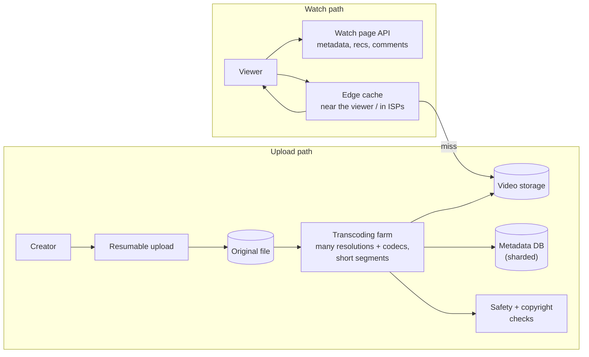
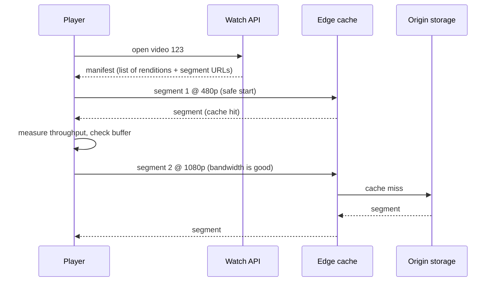

# How YouTube Works

*Hundreds of hours of video uploaded every minute, watched on every kind of device and network — built on processing pipelines, adaptive streaming, and caches close to viewers.*

---

> *“Broadcast Yourself.”*
>
> — **YouTube's original slogan**, from 2005

## At a Glance

> **In one sentence:** YouTube ingests uploads through resumable uploads, transcodes each video into many resolutions and codecs split into short segments, stores them durably, and streams them with adaptive bitrate through a global network of edge caches — while metadata, recommendations, comments, and view counts run on separate, independently scaled systems.

**You'll learn**

- The upload pipeline: resumable uploads, validation, transcoding, thumbnails
- Why videos are split into segments and encoded at many bitrates
- Adaptive bitrate streaming (DASH/HLS) and how players pick quality
- Edge caching and why popularity is so skewed
- Metadata at scale: Vitess and sharded MySQL
- Counting views, recommendations, and moderation as separate systems

**Before you start:** [How Caching Works](../05-Distributed-Systems/How-Caching-Works.md) · [How A Webpage Reaches Your Screen](../03-How-The-Internet-Works/How-A-Webpage-Reaches-Your-Screen.md)

**Reading time:** about 10 minutes

---

## The Big Picture



*Uploads are processed once, heavily; views are served millions of times, cheaply, from caches near viewers.*

---

## Introduction

When you upload a video, it may be watched by nobody — or by a hundred million people within a week. It may be viewed on a phone on a slow mobile connection, a laptop on Wi-Fi, or a 4K television on fiber. YouTube must handle all of these cases, for an enormous amount of new video: YouTube has stated that more than 500 hours of video are uploaded every minute.

The system that makes this work separates two very different problems: **processing** each upload (expensive, done once) and **delivering** video (cheap per view, done many times). This chapter explains both, plus the metadata systems that make the watch page work.

### Why Study It?

- It's a textbook example of separating write-heavy processing from read-heavy delivery.
- Adaptive streaming and edge caching are used by nearly every video and media service.
- YouTube's scaling of MySQL led to Vitess, now an open-source CNCF project.

---

## Scale and Constraints

| Dimension | Consideration |
|----------|--------------|
| Uploads | Hundreds of hours per minute, many formats and qualities |
| Views | Billions per day across devices and networks |
| Popularity | Extremely skewed: a small share of videos gets most views |
| Networks | From slow mobile to fast fiber, changing mid-video |
| Storage | Many encoded versions of every video, kept long-term |
| Latency | Video should start within about a second or two |

---

## Historical Background

- **2005 — YouTube launched,** making web video sharing easy with Flash-based playback.
- **2006 — Google acquired YouTube.**
- **2010 — Vitess** was started at YouTube to scale MySQL by sharding it behind a proxy layer; it later joined the CNCF and graduated in 2019.
- **2010s — HTML5 video and adaptive streaming** (MPEG-DASH, HLS) replaced Flash; YouTube adopted efficient codecs such as VP9 and later AV1.
- **2012 onward — Google Global Cache** placed caching servers inside internet service providers' networks to serve popular content locally.
- **2021 — Custom video chips.** Google described Argos, a video transcoding accelerator (VCU) developed for YouTube's scale.

---

## Architecture Overview

### Upload and Processing

1. **Resumable upload:** large files are uploaded in chunks so a dropped connection doesn't restart the upload.
2. **Validation:** format checks, virus and safety checks.
3. **Transcoding:** the original is decoded and re-encoded into many **renditions** — resolutions (144p to 4K+), bitrates, and codecs — each split into short **segments** (a few seconds each). This is massively parallel work: segments can be encoded independently.
4. **Thumbnails, captions, and audio tracks** are generated.
5. **Policy checks:** copyright matching (Content ID) and content moderation run on uploads.
6. **Metadata** (title, owner, status, renditions) is written to the metadata database, and the video becomes available — often starting with lower resolutions first, while higher ones finish processing.

### Delivery



- The player downloads a **manifest** listing available renditions and segment URLs.
- It fetches segments one after another, choosing the rendition for each based on measured bandwidth and how much video is buffered — **adaptive bitrate (ABR)**.
- Segments come from **edge caches** near the viewer; popular videos are almost always cache hits.

### The Watch Page

The video player is only part of the page. Metadata, recommendations, comments, likes, and view counts come from separate services, each scaled for its own workload. A slow comments service shouldn't stop video playback.

---

## Deep Dives

### Deep Dive 1: Why Segments and Multiple Bitrates?

- **Parallel encoding:** segments encode in parallel across many machines.
- **Adaptation:** the player can switch quality at each segment boundary as network conditions change.
- **Caching:** fixed segment files are easy to cache on CDNs and in ISP networks.
- **Seeking:** jump to any segment without downloading the whole file.

### Deep Dive 2: Skewed Popularity and Caching

A small share of videos receives most views. Edge caches holding popular segments serve most traffic, while the long tail of rarely watched videos is fetched from origin storage. Caches inside ISPs reduce long-distance traffic for both YouTube and the ISP.

### Deep Dive 3: Metadata at Scale with Vitess

YouTube's metadata was originally in MySQL. As it grew, Vitess added a proxy layer that routes queries to the right shard, manages connection pooling, and supports resharding — letting applications keep using MySQL while the data spreads across many servers.

### Deep Dive 4: Counting Views

A view counter for a viral video receives enormous write rates. Rather than updating one row per view, views are aggregated asynchronously (and filtered for validity and spam) — so counts can lag behind real time. That's a deliberate consistency trade-off.

---

## What Can Go Wrong

- **Transcoding backlogs** during upload surges — handled with large elastic processing capacity and prioritization.
- **Cache misses on sudden viral videos** — origin shielding (a middle cache tier) protects storage from stampedes.
- **Rebuffering on poor networks** — ABR algorithms balance quality against stalls.
- **Abuse:** spam, fake views, and policy-violating content — handled by separate detection systems.

---

## Lessons for Engineers

1. **Do expensive work once** at write time so reads are cheap.
2. **Split large objects into segments** for parallelism, caching, and adaptation.
3. **Let clients adapt** to their conditions (ABR) rather than serving one size to all.
4. **Put caches where the users are.**
5. **Decouple page components** so one slow feature doesn't block the core experience.
6. **Accept eventual consistency** for high-volume counters.

---

## Tradeoffs

| Choice | Benefit | Cost |
|-------|--------|-----|
| Many renditions per video | Every device/network served well | Storage and processing cost |
| Short segments | Fast adaptation | More requests; slight overhead |
| Newer codecs (VP9, AV1) | Less bandwidth for same quality | Heavier encoding; device support |
| Edge caches in ISPs | Low latency, less transit | Deployment and operations complexity |
| Async view counts | Scales to huge write rates | Counts lag behind reality |

---

## Interview Questions

### Beginner

**Q1: What is adaptive bitrate streaming?**

*Model answer:* The video is encoded at several quality levels and split into short segments; the player measures network speed and buffer level and picks the best quality it can sustain for each next segment, switching up or down as conditions change.

### Intermediate

**Q2: Why transcode a video into many versions?**

*Model answer:* Devices and networks differ widely; multiple resolutions, bitrates, and codecs let each viewer get the best playable version, enable adaptation during playback, and reduce bandwidth with efficient codecs where supported.

### Senior

**Q3: How would you design view counting for a video that goes viral?**

*Model answer:* Record view events asynchronously to a log or queue, validate and deduplicate them, aggregate counts in batches or with sharded counters, and periodically update the displayed count. Accept that the displayed count lags slightly, in exchange for scalability and spam filtering.

### Architecture

**Q4: Design a simplified video platform. What are the main components?**

*Model answer:* Resumable upload service, object storage for originals and renditions, a transcoding pipeline (queue + workers producing segmented renditions and manifests), a metadata database, a CDN or edge caches for segments, a watch API for metadata and manifests, and separate services for comments, recommendations, search, analytics, and moderation.

---

## Hands-On Lab

Simulate adaptive bitrate: a player choosing quality for each segment as bandwidth changes. Pure Python; save as `abr_lab.py` and run it.

```python
import random
random.seed(3)

RENDITIONS = [(240, 0.4), (480, 1.0), (720, 2.5), (1080, 5.0)]   # (height, Mbit/s)
SEGMENT_S = 4

def bandwidth(t):          # Mbit/s over time: good Wi-Fi, then a train tunnel, then recovery
    base = 6.0 if t < 40 else 0.8 if t < 70 else 4.0
    return max(0.2, random.gauss(base, base * 0.2))

def play(strategy, duration_s=120):
    t, buffer_s, stalls, chosen = 0.0, 0.0, 0.0, []
    est = 2.0
    while t < duration_s:
        height, rate = strategy(est, buffer_s)
        bw = bandwidth(t)
        download_s = rate * SEGMENT_S / bw
        est = 0.7 * est + 0.3 * bw                       # smoothed throughput estimate
        if download_s > buffer_s:                        # buffer ran dry while downloading
            stalls += download_s - buffer_s
            buffer_s = 0
        else:
            buffer_s -= download_s
        buffer_s += SEGMENT_S
        t += download_s
        chosen.append(height)
    return stalls, sum(chosen) / len(chosen)

def fixed_1080(est, buffer_s):
    return RENDITIONS[-1]

def adaptive(est, buffer_s):
    safe = est * (0.8 if buffer_s > 10 else 0.5)          # be cautious when the buffer is low
    return max((r for r in RENDITIONS if r[1] <= safe), default=RENDITIONS[0])

for name, strat in [("always 1080p", fixed_1080), ("adaptive", adaptive)]:
    stalls, avg_height = play(strat)
    print(f"{name:13} rebuffering {stalls:5.1f} s   average quality {avg_height:5.0f}p")
```

**What to notice**
- Always streaming 1080p looks great on good Wi-Fi but stalls badly in the "tunnel" — viewers hate rebuffering more than lower quality.
- The adaptive player lowers quality when bandwidth drops and the buffer is low, then climbs back. It trades some average quality for far less stalling.
- Real ABR algorithms (throughput-based, buffer-based, and hybrids) tune this balance carefully; try changing the safety factors and see the trade-off move.

---

## Test Yourself

*Answer each question in your head or on paper first, then open the answer to check.*

<details markdown="1">
<summary><strong>1. Why are uploads resumable?</strong></summary>

Large files over unreliable networks often get interrupted; chunked, resumable uploads continue where they left off instead of starting over.

</details>

<details markdown="1">
<summary><strong>2. What's in a streaming manifest?</strong></summary>

The list of available renditions (qualities/codecs) and the URLs of their segments.

</details>

<details markdown="1">
<summary><strong>3. Why does skewed popularity make caching so effective for video?</strong></summary>

A small share of videos accounts for most views, so caching popular segments near users serves most traffic.

</details>

<details markdown="1">
<summary><strong>4. What is Vitess?</strong></summary>

A system created at YouTube to scale MySQL by sharding it behind a routing proxy, now an open-source CNCF project.

</details>

<details markdown="1">
<summary><strong>5. Why might a view count lag behind reality?</strong></summary>

Views are processed asynchronously — validated, deduplicated, and aggregated — to handle huge write rates and filter spam.

</details>

<details markdown="1">
<summary><strong>6. What's the benefit of codecs like VP9 and AV1?</strong></summary>

Similar visual quality at lower bitrates, saving bandwidth — at the cost of heavier encoding and device support considerations.

</details>

---

## Cheat Sheet

**Upload:** resumable upload → validate → transcode into renditions × segments → thumbnails/captions → policy checks → metadata → available.

**Watch:** manifest → segments from edge caches → ABR picks quality per segment → other page parts from separate services.

| Idea | Why |
|-----|----|
| Segments | Parallel encoding, adaptation, caching, seeking |
| Many renditions | Every device and network |
| ABR | Balance quality vs. rebuffering |
| Edge caches in ISPs | Low latency, less backbone traffic |
| Sharded metadata (Vitess) | Scale MySQL |
| Async counters | Handle viral write rates |

---

## In the AI Era

- **AI runs throughout video platforms:** recommendations, automatic captions and translation, content moderation, copyright matching, and thumbnail and chapter generation — mostly as asynchronous processing after upload.
- **Generative video** multiplies processing and storage demands and raises new moderation and provenance challenges.
- **The architectural pattern is the same:** do heavy AI work once in pipelines, store results, and serve cheaply — rather than running models on every view.

**Try it:** Add an "auto-caption" step to the upload pipeline in the Big Picture diagram. Should the video become available before captions finish? What's the trade-off?

---

## Key Takeaways

1. Separate expensive, once-per-upload processing from cheap, many-times delivery.
2. Segmented, multi-bitrate encoding enables parallel processing, caching, and adaptation.
3. Adaptive bitrate balances video quality against rebuffering on changing networks.
4. Edge caches near users serve the heavily skewed popular content.
5. Metadata and other page features run on separately scaled services (e.g., Vitess for MySQL).
6. High-volume counters are aggregated asynchronously, accepting slight lag.

---

## What to Read Next

- **[How Netflix Streams Video](How-Netflix-Streams-Video.md)** — a different approach to video delivery
- **[How WhatsApp Works](How-WhatsApp-Works.md)** — real-time messaging at global scale
- **[Database Sharding](../08-Scalability/Database-Sharding.md)** — the ideas behind Vitess

---

## Further Reading

- **YouTube Official Blog and press statistics** (upload and viewing figures)
- **Vitess documentation and history:** [https://vitess.io](https://vitess.io)
- **Google — "Warehouse-scale video acceleration: co-design and deployment in the wild" (ASPLOS 2021)** — the Argos VCU
- **MPEG-DASH and Apple HLS specifications**
- **Google Global Cache:** [https://support.google.com/interconnect/answer/9058809](https://support.google.com/interconnect/answer/9058809)

---

*This chapter is part of the Modern Software Engineering Handbook — a comprehensive guide to the concepts, principles, and practices that every professional software engineer should know.*
