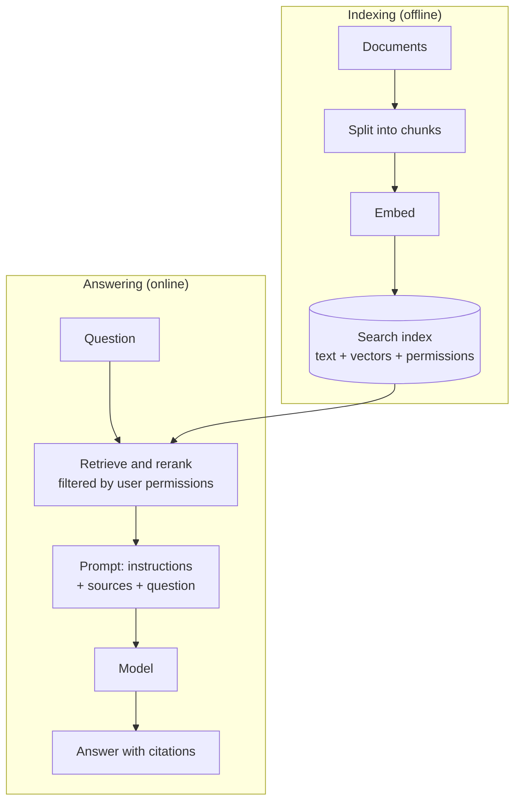

# Building LLM-Powered Systems: Retrieval, Tools, and Agents

*The model is one component. The system around it — context, tools, validation, and operations — is where the engineering happens.*

---

> *“A complex system that works is invariably found to have evolved from a simple system that worked.”*
>
> — **John Gall**, *Systemantics*, 1975 ("Gall's Law")

## At a Glance

> **In one sentence:** An LLM-powered product is a system — retrieval, tools, workflows or agents, validation, guardrails, observability, and cost control around a model — and most quality problems are fixed in that system, not by changing the model.

**You'll learn**

- The complexity ladder from single prompt to multi-agent
- How retrieval-augmented generation (RAG) works end to end
- Designing safe, effective tools for models
- Agent loops, limits, and side effects
- Structured output, guardrails, and validation
- Tracing, reliability patterns, and cost control

**Before you start:** [How LLMs Actually Work](How-LLMs-Actually-Work.md) · [Why Distributed Systems Are Hard](../05-Distributed-Systems/Why-Distributed-Systems-Are-Hard.md)

**Reading time:** about 10 minutes

---

## The Big Picture



*Retrieval-augmented generation has two pipelines: indexing documents ahead of time, and retrieving the relevant pieces for each question.*

---

## Introduction

A company builds an internal assistant to answer employee questions about HR policy. Version one is a single call: the employee's question goes to a model with a system prompt. It answers confidently — and often wrongly, because it has never seen this company's policies.

Version two pastes the entire 900-page policy manual into every request. Answers improve, but each question now costs about a hundred times more, takes fifteen seconds, and still misses details buried in the middle of the manual.

Version three retrieves the five most relevant policy sections for each question, includes them with their titles and links, asks the model to answer only from those sources and cite them, and says "I couldn't find this in the policies" when retrieval comes back empty. It is faster, cheaper, more accurate, and — because every answer links to its source — trustworthy enough that people actually use it.

The model was identical in all three versions. **The system design changed everything.**

### Why Should Engineers Care?

Most AI product quality problems are system design problems: the wrong context, missing tools, no validation, no evaluation, no fallback. These are classic engineering concerns — data pipelines, caching, retries, observability — applied to a new kind of component. This chapter covers the core patterns.

---

## The Problem It Solves

A raw model call has fundamental gaps:

| Gap | Consequence | System-level solution |
|-----|------------|----------------------|
| Knows nothing about your private data | Generic or invented answers | Retrieval (RAG) |
| Knowledge frozen at a training cutoff | Outdated answers | Retrieval, search tools |
| Can't take actions or get live data | Can only talk | Tool use |
| Can't complete multi-step tasks alone | Gives up or guesses | Workflows and agents |
| Output is unstructured and unverified | Breaks downstream code | Structured output + validation |
| Quality varies unpredictably | Silent regressions | Evaluation and monitoring |

---

## Historical Background

- **Before 2020 — Search + reading comprehension.** Question-answering systems retrieved documents and used specialized models to extract answer spans.
- **2020 — Retrieval-Augmented Generation.** Lewis et al. coined "RAG," combining a retriever with a generative model so answers could draw on an external knowledge source.
- **2022 — Reasoning and acting.** Research such as chain-of-thought prompting (Wei et al.) and ReAct (Yao et al.) showed models perform better when they reason in steps and interleave reasoning with actions like searches.
- **2023 — Function calling.** Model APIs added native tool calling with JSON-schema-defined functions, making tool use reliable enough for production.
- **2024 — Standardizing tool connections.** The Model Context Protocol (MCP), introduced by Anthropic in November 2024 as an open standard, gave AI applications a common way to connect to tools and data sources instead of building one-off integrations for every pairing.
- **2024–present — Production agents.** Agents that operate over many steps — coding, research, customer support, operations — moved from demos into production, bringing classic distributed-systems concerns (state, retries, idempotency, cost control) along with them.

---

## Core Concepts

### The Complexity Ladder

Always use the simplest pattern that solves the problem. Each step up adds capability *and* failure modes.

```
Level 0   Single prompt                "Classify this ticket"
Level 1   Prompt + retrieved context    "Answer using these policy sections"
Level 2   Fixed workflow (chain)        extract → validate → summarize → format
Level 3   Workflow with routing         classify → route to specialized prompt
Level 4   Tool-using agent              model decides which tools to call, in a loop
Level 5   Multi-agent systems           several agents coordinating
```

A **workflow** is a sequence of steps *your code* controls. An **agent** is a loop in which *the model* decides the next step. Workflows are more predictable, cheaper, and easier to test; agents handle open-ended tasks where the steps can't be known in advance. Many successful production systems are mostly workflows with agentic steps only where genuinely needed.

### Retrieval-Augmented Generation (RAG)

RAG supplies the model with relevant external knowledge at request time.

**Indexing pipeline (offline):**
```
Source documents ──► Clean & split into chunks ──► Embed each chunk ──► Store vectors
                                                                        + text
                                                                        + metadata (source, ACLs, date)
```

**Query pipeline (online):**
```
User question
     │
     ▼
(optional) rewrite query ──► retrieve top-k chunks ──► (optional) rerank
                                                            │
                                                            ▼
                         Prompt = instructions + retrieved chunks + question
                                                            │
                                                            ▼
                                                  Model answers with citations
```

Key design decisions:
- **Chunking:** chunks too small lose context; too large dilute relevance. Split on natural boundaries (sections, paragraphs, functions) and keep titles/headings with each chunk.
- **Hybrid retrieval:** combine keyword search (exact terms, IDs, error codes) with vector search (meaning). This usually beats either alone.
- **Reranking:** retrieve many candidates cheaply, then use a more precise model to reorder the top results.
- **Metadata filters:** enforce tenant boundaries and access permissions *at query time*.
- **Citations:** return sources with answers so users (and evaluators) can verify.

### Tool Use

A **tool** is a function you expose to the model with a name, description, and input schema. Good tools are designed like good APIs — for a reader that is literal-minded and easily confused:

- **Clear names and descriptions**, including when *not* to use the tool.
- **Narrow, well-typed parameters** (enums instead of free text where possible).
- **Helpful error messages** the model can act on ("order_id must look like A123; got 'my order'").
- **Concise results** — return what the model needs, not a 5,000-line API response.
- **Least privilege** — a `read_order` tool rather than a generic `run_sql`.

### Agents

An agent is a loop:

```
while not done:
    response = model(context)            # model decides: answer, or call tool(s)
    if response.is_final_answer:
        done = True
    else:
        results = execute(response.tool_calls)   # your code, your permissions
        context.append(response, results)
    enforce_limits(steps, tokens, time, cost)    # always
```

What makes agents hard is not the loop — it's everything around it:

- **Context management:** long runs accumulate history until the window fills; summarize, prune, or store state externally.
- **Termination:** agents can loop, give up early, or declare success prematurely. Define clear completion criteria and hard limits.
- **Side effects:** tool calls that change the world need idempotency, confirmation, and audit logs.
- **Recovery:** long runs should checkpoint progress so a failure doesn't mean starting over.

### Structured Output

Downstream code needs predictable data. Ask for output conforming to a JSON schema (using native structured-output features where available), parse it strictly, validate semantic constraints in code, and define what happens on failure — retry with the error message, fall back, or escalate to a human.

### Guardrails

Guardrails are checks around the model call:
- **Input:** size limits, PII detection, classification of disallowed requests.
- **Output:** schema validation, policy checks, grounding checks (does the answer's claim appear in the sources?), and filters before anything reaches users or other systems.
- **Action:** permission checks and human approval before side-effecting tool calls.

---

## Real-World Analogy

A good LLM system resembles a well-run research desk at a newspaper.

The writer (the model) is fast and articulate. The librarian (retrieval) pulls the relevant files for each story. Reporters' tools — phone, databases, records requests — are the writer's tools, each with rules about who may use them. The editor (validation and guardrails) checks facts against sources and rejects stories that don't meet the style guide. And the paper tracks corrections over time (evaluation and monitoring) to find which beats produce the most errors.

Nobody would run a newspaper by hiring one brilliant writer and printing whatever they type.

---

## How It Works Internally: An End-to-End Request

A support assistant handles: *"Why was I charged twice this month?"*

```
1. Gateway        authenticate user → rate limit (tokens/cost budget) → log request ID
2. Router         small, fast model classifies intent: "billing_question"
3. Retrieval      fetch billing-policy chunks (filtered to user's plan & region)
4. Agent loop     model with tools: get_invoices(user), get_payments(user)
                   ├─ call get_invoices  → 2 invoices found
                   ├─ call get_payments  → 1 payment + 1 pre-authorization hold
                   └─ final answer: explains the hold, cites policy section
5. Validation     output schema OK; claims reference retrieved data; no PII of others
6. Response       stream answer to user, show cited policy link
7. Telemetry      trace: tokens, latency per step, tools called, cost, model version
8. Feedback       user thumbs-up/down stored with trace for evaluation
```

Notice how little of this is "the AI." Authentication, rate limiting, retrieval, permissioned tools, validation, streaming, and tracing are standard system components.

---

## Production Engineering Perspective

### Observability

Log a **trace** for every AI interaction:

| Field | Why |
|------|----|
| Model name and version, prompt version | Reproduce and attribute regressions |
| Full input context (or reference to it) and output | Debug what the model actually saw |
| Retrieved document IDs and scores | Distinguish retrieval failures from generation failures |
| Tool calls, arguments, results, errors | Debug agent behavior |
| Tokens (input, cached, output), latency, cost | Performance and budget |
| User feedback, downstream outcome | Quality measurement |

Be deliberate about privacy: traces contain user data, so apply the same retention and access controls as any sensitive log.

### Reliability Patterns

- **Timeouts** on every model and tool call, sized for realistic generation lengths.
- **Retries with exponential backoff and jitter** for transient errors and rate limits — never for non-idempotent side effects without idempotency keys.
- **Fallbacks:** secondary model or provider, cached answers, or a non-AI path ("here are the top matching help articles").
- **Circuit breakers** so a failing provider doesn't consume all your threads and budget.
- **Streaming** to reduce perceived latency.
- **Asynchronous processing** for long tasks: accept the job, run it in the background, notify on completion.

### Cost Control

- Route simple requests to smaller models.
- Structure prompts for prefix caching (stable content first).
- Retrieve fewer, better chunks rather than more.
- Cap output tokens and agent steps.
- Batch offline workloads (many providers offer discounted batch processing).
- Track cost per feature and per customer, not just in total.

---

## Tradeoffs

| Decision | Tradeoff |
|---------|---------|
| Workflow vs. agent | Predictability and cost vs. flexibility on open-ended tasks |
| Long context vs. retrieval | Simplicity and recall vs. cost, latency, and focus |
| Many small tools vs. few general tools | Safety and clarity vs. flexibility (and more tool-selection errors) |
| One large model vs. routing across models | Simplicity and quality vs. cost savings and complexity |
| Multi-agent vs. single agent | Parallelism and separation of concerns vs. coordination overhead and harder debugging |
| Real-time vs. batch | Interactivity vs. cost and throughput |

---

## Common Mistakes

1. **Starting with an agent** when a single prompt or fixed workflow would do.
2. **Evaluating RAG only on final answers.** Measure retrieval separately — if the right chunk wasn't retrieved, no prompt can fix it.
3. **Ignoring permissions in retrieval**, letting users query documents they can't access directly.
4. **Returning huge tool outputs** that flood the context window.
5. **No step or cost limits on agents.**
6. **Hiding sources.** Uncited answers can't be verified by users or evaluators.
7. **No fallback path** when the model provider is down or slow.
8. **Not logging retrieved context**, making "why did it say that?" impossible to answer.

---

## Failure Scenarios

### Scenario 1: The Stale Index

Retrieval serves last quarter's pricing because the re-indexing job has silently failed for three weeks. The assistant confidently quotes old prices, and sales has to honor several of them.

**Prevention:** monitor index freshness as an SLO; alert on pipeline failures; show document dates in answers; reconcile the index against the source of truth.

### Scenario 2: The Infinite Agent

An agent tasked with "fix the failing build" hits an error it can't resolve and alternates between two approaches for 400 iterations overnight, spending a large amount on tokens.

**Prevention:** hard limits on steps, time, and cost; loop detection (repeated identical tool calls); escalation to a human when progress stalls.

### Scenario 3: The Duplicate Refund

A support agent calls `issue_refund`. The call succeeds, but the response times out before reaching the agent. The agent retries. The customer is refunded twice.

**Prevention:** idempotency keys on side-effecting tools; human approval above an amount threshold; tool results that report prior identical actions.

### Scenario 4: The Cross-Tenant Leak

A shared vector index lacks tenant filtering on one code path. A customer's question retrieves another customer's document chunks, and the model helpfully summarizes them.

**Prevention:** mandatory tenant filters enforced in the retrieval layer (not in prompts); separate indexes or namespaces per tenant for sensitive data; automated tests that attempt cross-tenant retrieval.

---

## Security Considerations

- Retrieved documents, web pages, emails, and tool outputs are **untrusted input** and can contain prompt injection.
- Tools define what an attacker can do if they control the model's behavior; scope them tightly.
- Enforce authorization in the tool layer using the *end user's* identity, never the agent's broad service account alone.
- Require human confirmation for high-impact actions.

See *Securing AI Systems* for the full treatment.

---

## Practical Code Examples

### A Minimal, Bounded Agent Loop

```python
import json
import time

MAX_STEPS = 12
MAX_SECONDS = 120
MAX_COST_USD = 0.50

class BudgetExceeded(Exception):
    pass

def run_agent(llm, tools: dict, task: str, user) -> str:
    messages = [{"role": "user", "content": task}]
    tool_specs = [t.spec for t in tools.values()]
    started, cost, seen_calls = time.monotonic(), 0.0, set()

    for step in range(MAX_STEPS):
        response = llm.complete(messages=messages, tools=tool_specs,
                                max_output_tokens=1_000)
        cost += response.cost_usd
        if cost > MAX_COST_USD or time.monotonic() - started > MAX_SECONDS:
            raise BudgetExceeded(f"step={step} cost={cost:.2f}")

        if not response.tool_calls:
            return response.text                  # final answer

        messages.append(response.as_message())
        for call in response.tool_calls:
            signature = (call.name, json.dumps(call.arguments, sort_keys=True))
            if signature in seen_calls:
                result = {"error": "Identical call already made; try a different approach."}
            elif call.name not in tools:
                result = {"error": f"Unknown tool {call.name}"}
            else:
                seen_calls.add(signature)
                # Authorization uses the end user's identity, inside the tool.
                result = tools[call.name].run(call.arguments, acting_user=user)
            messages.append({"role": "tool", "tool_call_id": call.id,
                             "content": json.dumps(result)[:8_000]})  # cap size

    raise BudgetExceeded("step limit reached")
```

### A Side-Effecting Tool With Idempotency and Approval

```python
def issue_refund(args: dict, acting_user) -> dict:
    order = orders.get(args["order_id"])
    if order is None or order.customer_id != acting_user.customer_id:
        return {"error": "Order not found for this customer."}
    if args["amount"] > order.amount_paid:
        return {"error": "Refund exceeds amount paid."}

    idempotency_key = f"refund:{order.id}:{args['amount']}"
    if refunds.exists(idempotency_key):
        return {"status": "already_refunded", "refund_id": refunds.get(idempotency_key).id}

    if args["amount"] > 100:
        ticket = approvals.request(kind="refund", payload=args, requested_by=acting_user)
        return {"status": "pending_human_approval", "ticket": ticket.id}

    refund = payments.refund(order.id, args["amount"], idempotency_key=idempotency_key)
    return {"status": "refunded", "refund_id": refund.id}
```

The model can *ask* for a refund. The code decides whether it happens.

---

## Frequently Asked Questions

**Do I need a vector database to do RAG?**
No. Start with what you have: many relational databases and search engines support vector search. Keyword search alone is a strong baseline for many corpora.

**How many chunks should I retrieve?**
Measure it. Start around 5–10, evaluate retrieval recall and answer quality, and adjust. Reranking lets you retrieve broadly and pass only the best to the model.

**When should I use multiple agents?**
When subtasks are genuinely independent and benefit from parallelism or separate contexts (e.g., researching several topics at once). Otherwise, one agent with good tools is simpler to build and debug.

**What is MCP, and do I need it?**
The Model Context Protocol is an open standard for connecting AI applications to tools and data sources. It's useful when you want tools reusable across multiple AI clients, or want to plug existing MCP servers into your application. For a single application with a few internal tools, native function calling may be enough.

---

## Interview Questions

### Beginner

**Q1: What is RAG and why is it used?**

*Model answer:* Retrieval-Augmented Generation retrieves relevant documents from an external knowledge source at request time and includes them in the model's context. It lets a model answer using private, up-to-date information without retraining, reduces hallucination by grounding answers in sources, and enables citations.

### Intermediate

**Q2: Users complain your RAG assistant gives wrong answers. How do you debug it?**

*Model answer:* Separate retrieval from generation. For a set of failing questions, check whether the correct source chunk was retrieved at all. If not, it's a retrieval problem: chunking, embeddings, missing hybrid keyword search, filters, or a stale index. If the right chunk was retrieved but the answer is still wrong, it's a generation problem: prompt, context ordering, too much irrelevant context, or model capability. Then I'd build an evaluation set from these cases to measure the fix.

**Q3: How do you make a tool safe for an agent to call?**

*Model answer:* Give it the narrowest capability that serves the task, strictly validate its inputs, authorize using the end user's identity, make side effects idempotent, require human approval for high-impact actions, cap output size, return actionable errors, and log every call. Treat the model as an untrusted client of the tool.

### Senior

**Q4: Design an AI assistant that answers questions over a company's internal documents with strict access control.**

*Model answer:* Index documents with their ACLs as metadata, synchronized from the source systems via change data capture so permission changes propagate quickly. At query time, authenticate the user, resolve their groups, and filter retrieval by permissions in the retrieval layer — never rely on the prompt. Use hybrid retrieval and reranking, and have the model answer only from retrieved sources with citations. Log traces with retrieved document IDs, monitor index freshness, run permission-leak tests in CI, and maintain an evaluation set covering accuracy, citation correctness, and "not found" behavior.

### Architecture / Leadership

**Q5: A team proposes a multi-agent architecture for a new feature. How do you evaluate it?**

*Model answer:* Ask what simpler design they tried and why it failed. Multi-agent systems multiply cost, latency, and failure modes, and are harder to debug. I'd want evidence from an evaluation set that a single agent or a fixed workflow falls short, a clear reason the subtasks need separate contexts or parallelism, defined interfaces between agents, per-agent tracing, and hard limits on total cost and time. If those exist, it can be the right call; if not, start simpler.

---

## Hands-On Lab

Build the "retrieval" half of RAG in about 30 lines of pure Python, and see why answers need a "not found" path.

```python
import math, re
from collections import Counter

docs = {
    "refund-policy":  "Refunds are available within 30 days of purchase for unused items with a receipt.",
    "shipping":       "Standard shipping takes 3 to 5 business days. Express shipping takes 1 to 2 days.",
    "warranty":       "Electronics include a one year warranty covering manufacturing defects.",
    "returns-label":  "To return an item, print a prepaid label from your order page.",
    "store-hours":    "Stores are open 9am to 9pm Monday to Saturday and closed on Sunday.",
}

STOP = {"a", "an", "the", "is", "are", "to", "do", "i", "you", "my", "your", "on", "of", "for",
        "in", "and", "with", "how", "many", "have", "get", "there", "from", "at"}
tokenize = lambda text: [w for w in re.findall(r"[a-z0-9]+", text.lower()) if w not in STOP]
doc_tokens = {d: Counter(tokenize(t)) for d, t in docs.items()}
df = Counter(word for counts in doc_tokens.values() for word in counts)
idf = {w: math.log(len(docs) / df[w]) for w in df}

def search(question, k=2, min_score=0.5):
    q = tokenize(question)
    scores = {d: sum(counts[w] * idf.get(w, 0) for w in q) for d, counts in doc_tokens.items()}
    ranked = sorted(scores.items(), key=lambda x: -x[1])[:k]
    return [(d, round(s, 2)) for d, s in ranked if s >= min_score]

def build_prompt(question):
    hits = search(question)
    if not hits:
        return "NO SOURCES FOUND -> answer: \"I couldn't find that in our policies.\""
    sources = "\n".join(f"[{d}] {docs[d]}" for d, _ in hits)
    return (f"Answer using ONLY the sources below and cite them like [id].\n"
            f"{sources}\n\nQuestion: {question}")

for q in ["How many days do I have to get a refund?",
          "Is there a warranty on my laptop?",
          "Do you sell gift cards?"]:
    print(q, "->", search(q))
    print(build_prompt(q), "\n")
```

**What to notice**
- The refund question ranks the **shipping** page first. The shipping page mentions "days" twice, and the word "refund" doesn't match "Refunds" because there's no stemming. The correct page still arrives in second place, which is why RAG systems retrieve several chunks and often add a **reranker**.
- The warranty question works only because the exact word "warranty" matches. Add `"Is my computer covered if it breaks?"` to the list: nothing is found, even though the warranty page is the answer. That gap between words and meaning is why real systems add **embeddings** (semantic search) to keyword search — hybrid retrieval.
- The gift-card question finds nothing, so the system says so instead of letting a model improvise. Grounding includes knowing when you have no grounds.
- Every RAG quality problem you'll meet starts here: look at what was retrieved before blaming the model.

---

## Test Yourself

*Answer each question in your head or on paper first, then open the answer to check.*

<details markdown="1">
<summary><strong>1. What is the difference between a workflow and an agent?</strong></summary>

In a **workflow**, your code decides the sequence of steps. In an **agent**, the model decides the next step in a loop, choosing which tools to call. Workflows are more predictable and cheaper; agents handle open-ended tasks.

</details>

<details markdown="1">
<summary><strong>2. Name the two pipelines in a RAG system.</strong></summary>

**Indexing** (offline): clean documents, split them into chunks, embed them, and store vectors with metadata. **Query** (online): take the question, retrieve relevant chunks, optionally rerank, build a prompt with them, and generate an answer with citations.

</details>

<details markdown="1">
<summary><strong>3. Why combine keyword search with vector search?</strong></summary>

Keyword search excels at exact terms — names, IDs, error codes — while vector search finds matching meaning with different words. Hybrid retrieval usually beats either alone.

</details>

<details markdown="1">
<summary><strong>4. A RAG assistant gives a wrong answer. What should you check first?</strong></summary>

Whether the right source chunk was retrieved. If not, it's a retrieval problem (chunking, search, filters, stale index). If it was, it's a generation problem (prompt, context, model).

</details>

<details markdown="1">
<summary><strong>5. Why must permissions be enforced in the retrieval layer rather than the prompt?</strong></summary>

Prompts are behavioral guidance, not access control. Once a document is in the context, the model can repeat it. Filtering by the user's permissions before retrieval guarantees they only see what they're allowed to.

</details>

<details markdown="1">
<summary><strong>6. What limits should every agent loop have?</strong></summary>

Maximum steps, wall-clock time, tokens, and cost, plus detection of repeated identical tool calls. Without them, a confused agent can loop indefinitely and run up large bills.

</details>

<details markdown="1">
<summary><strong>7. How do you make a side-effecting tool safe to retry?</strong></summary>

Use idempotency keys so a repeated call returns the original result instead of acting twice, and require human approval for high-impact actions.

</details>

---

## Cheat Sheet

**Complexity ladder:** single prompt → prompt + RAG → fixed workflow → routing → tool-using agent → multi-agent. Climb only when evidence says you must.

| Component | Key decisions |
|----------|--------------|
| Chunking | Natural boundaries; keep headings with chunks |
| Retrieval | Hybrid keyword + vector; metadata and permission filters |
| Reranking | Retrieve broadly, pass only the best to the model |
| Tools | Narrow, typed, least privilege, helpful errors, capped output |
| Agents | Step/time/token/cost limits; loop detection; checkpoints |
| Output | JSON schema + validation + truncation check |
| Guardrails | Input checks, output checks, approval for actions |
| Observability | Trace model, prompt version, retrieved IDs, tools, tokens, cost |

**Reliability:** timeouts · retries with backoff (only when safe) · fallbacks (other model, cached answer, non-AI path) · circuit breakers · streaming · async for long jobs.

---

## Key Takeaways

1. The model is one component; retrieval, tools, validation, evaluation, and operations determine product quality.
2. Climb the complexity ladder only as needed: prompt → RAG → workflow → agent → multi-agent.
3. RAG is a data pipeline: chunking, hybrid retrieval, reranking, permissions, and freshness all matter.
4. Design tools like careful APIs for a literal-minded client: narrow, validated, least-privilege, with helpful errors.
5. Agents are distributed workflows — they need limits, idempotency, checkpoints, and observability.
6. Trace every interaction: model, prompt version, retrieved context, tool calls, tokens, cost, and outcome.
7. Enforce authorization and high-impact decisions in code, never in prompts.

---

## What to Read Next

- **[Evaluating AI Systems](Evaluating-AI-Systems.md)** — measuring whether your system actually works
- **[Securing AI Systems](Securing-AI-Systems.md)** — defending retrieval and tools against injection
- **[Data Replication Strategies](../04-Data-And-Storage/Data-Replication-Strategies.md)** — keeping RAG indexes in sync with the source

---

## Further Reading

- **"Retrieval-Augmented Generation for Knowledge-Intensive NLP Tasks" (2020)** — Lewis et al.: [https://arxiv.org/abs/2005.11401](https://arxiv.org/abs/2005.11401)
- **"ReAct: Synergizing Reasoning and Acting in Language Models" (2022)** — Yao et al.: [https://arxiv.org/abs/2210.03629](https://arxiv.org/abs/2210.03629)
- **"Chain-of-Thought Prompting Elicits Reasoning in Large Language Models" (2022)** — Wei et al.: [https://arxiv.org/abs/2201.11903](https://arxiv.org/abs/2201.11903)
- **"Building Effective Agents"** — Anthropic engineering blog, on workflows vs. agents and when to use each: [https://www.anthropic.com/engineering/building-effective-agents](https://www.anthropic.com/engineering/building-effective-agents)
- **Model Context Protocol specification:** [https://modelcontextprotocol.io](https://modelcontextprotocol.io)
- **"Designing Data-Intensive Applications"** — Martin Kleppmann. The data-pipeline, replication, and consistency chapters apply directly to RAG indexing.
- **"Release It!"** — Michael Nygard. Timeouts, circuit breakers, and bulkheads, all of which apply to model and tool calls.

---

*This chapter is part of the Modern Software Engineering Handbook — a comprehensive guide to the concepts, principles, and practices that every professional software engineer should know.*
